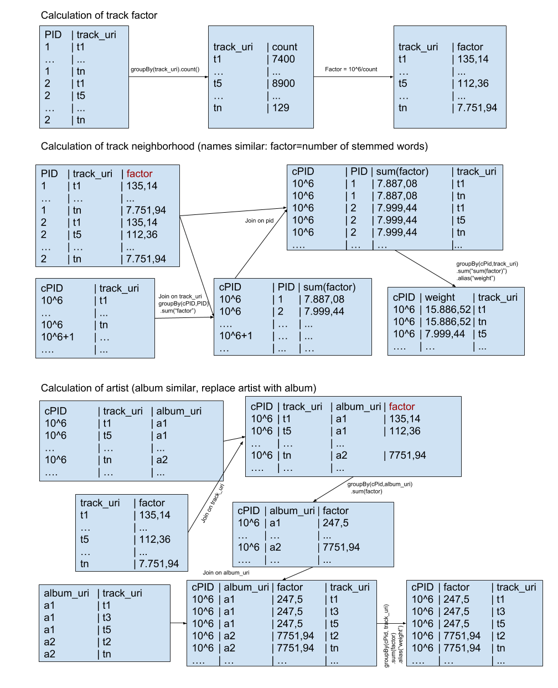

# recsyschallenge2018

## Submission Information

Teamname: TUW-Alpha

Track: Main

## Information

For the course Advanced Programming Paradigms (title next year: data-intensive Programming) at TU Wien, we participated in the RecSys Challenge to learn how to deal with big data problems. 

For this course we are forced to use Spark on our new cluster at university. The cluster provided Spark 2.2 and I used the python implementation (mostly the pyspark shell) to run the program at our cluster. Our cluster had some starting difficulties and large jobs where blocking all other users. Therefore, I decided to use a simple neighborhood approach for the tracks and some basic text stemming for the playlists without seed tracks to get better matches than the top500 (which was my filler if I recommended less than 500 tracks with the other methods). 

I have also tried to include some artist or album information, but due to cluster resource problems and time issues with lots of exams I was not able to calculate a good weight for including this weights and therefore skipped it in the final submission.

> Note: I have added my code files for these (album.py and artist.py) as well, even if the code is not used in the end.

Also the text processing is on a really basic level. There is no stop-word filtering applied and no mechanism implemented to find similar names like "christmas" and "x-mas", only stemming is used to normalize the words somehow. The weight is also really simple by just calculating how many words are equal between a mpd playlist and a challenge playlist. So there is much room to improve the playlist name predicition.

For a more detailed explenation how my code works, I have created a image, which visualizes the steps of the code. If there are any questions, please feel free to ask and I will add the answers to the README file.

## Execution

* Spark 2.2 required (http://spark.apache.org/)
* nltk.stem package required (http://www.nltk.org/api/nltk.stem.html)
* Change the folder names to match your file system in code
* Use the Pysparkshell for the code snippets
* Run track_factor.py - Calculates how much information a track provides
* Run track_neighborhood.py - Calculates the neighborhood of the seed tracks for each challenge playlist
* Run names.py - Calculate similar playlists based on the playlist name
* Run top500.py - Calculates overall top500 popular songs
* Run solution_generator.py - Combines the different results generated by the scripts before.

> Note: I have modified my source code and removed personal informations like mail address and file paths before publishing the source code here on Github.
